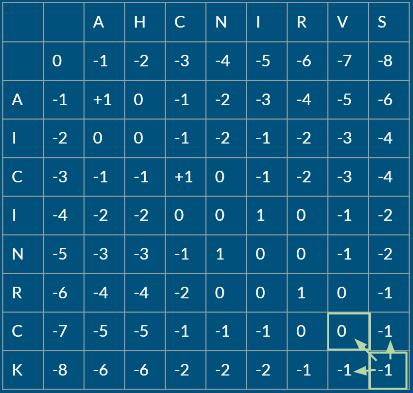

## Alineamientos y Búsqueda de similitud secuencial

- JUNTAS A LA PAR

**PARA PENSAR: ¿Qué tipo de información se puede extraer de la comparación de secuencias? ¿Cómo esperás que se vea en una comparación?**

De una comparacion entre dos secuencias se puede saber si son homologas (si hay relaciones evolutivas) y saber si cumplen con la misma funcion.
De una comparacion espero que haya varias columnas iguales, ya que se suele comparar preferiblemente secuencias parecidas.

**PARA PENSAR: ¿Por qué crees que es mejor evaluar las relaciones evolutivas lejanas comparando proteínas?**

Porque cuando uno compara secuencias de proteinas de diferentes especies, podemos ver que tan homologas o parecidas son.
Mientras mas secuencias agreguemos, vamos a poder ver lo próximas o lejanas que se encuentran esas especies en la escala evolutiva.

- PARECIDO NO ES LO MISMO

**DESAFIO I: Intentemos, entonces alinear estas dos palabras, para comprender mejor el problema. Alineá en la tabla interactiva las palabras "BANANA" y** 
**"MANZANA".**
**¡Tomá nota de tus observaciones y de las conclusiones que se desprendan de estas observaciones! PREGUNTAS DISPARADORAS: ¿Existe una única forma** 
**de alinearlas? ¿Es alguno de los posibles alineamientos mejor que otro? Si así fuera ¿Por qué?**

No existe una unica forma de alinearla. Hay otras formas sin alterar la primera alineacion.
Si hay una forma mejor de alinear las palabras, corriendo una A para que no haya un mismatch de A con Z, que implica poner un GAP.

BAN_ANA
MANZANA

**DESAFIO II: En la siguiente tabla probá distintos alineamientos para las palabras "ANA" y "ANANA". Verás que en el margen superior izquierdo aparece** 
**un valor de identidad calculado para cada alineamitno que intentes.**
**Tomá nota de los valores de identidad observados y de las conclusiones que se desprendan de estas observaciones.**

**PREGUNTAS DISPARADORAS: ¿Son todos los valores iguales? ¿Qué consideraciones deberían tenerse en cuenta a la hora de realizar el cálculo?** 
**¿Se te ocurre, distintas formas de calcularlo? ¿Serán todas ellas igualmente válidas en Biología?**

Al momento de querer realizar un alineamiento, habria que tener en cuenta si ambas secuencias son del mismo tamaño y si tienen partes similares.
Las formas de calcular el score, en biologia va a depender de las probabilidades de que un aminoacido pueda transformarse en otro.

**DESAFIO III: Probá en tabla interactiva distintos alineamientos para las palabras "ANA" y "ANANA". Verás que en el margen superior izquierdo aparece** 
**un valor de identidad calculado para cada alineamiento que intentes y un botón para cambiar la penalidad que se le otorga a dicho para el cálculo de** 
**identidad.**

**Probá varias combinaciones, tomá nota de los valores de identidad observados y de las conclusiones que se desprendan de estas observaciones.**
**PREGUNTAS DISPARADORAS: ¿Cómo se relacionan los valores de identidad obtenidos con las penalizaciones que se imponen al gap?** 
**¿Qué implicancias crees que tiene una mayor penalización de gaps? ¿Se te ocurre alguna otra forma de penalización que no haya sido tenido en cuenta** 
**en este ejemplo?**

A la identidad final obtenida, se le restan los gaps usados (valor calculado a mano en este ejemplo) a modo de penalizacion.
Si un debe usar mas gaps, es debido o a que 2 aminoacidos no matchean, no son el mismo o una de las cadenas es mas corta.
Otra forma de penalizar es poniendo 2 aminoacidos en una misma columna que no matcheen.

**PARA PENSAR: Entonces, pensando en un alineamiento de ácidos nucleicos ¿Cuáles te parece que son las implicancias de abrir un gap en el alineamiento?** 
**¿Qué implicaría la inserción o deleción de una región de más de un residuo?**

Utilizando la tabla interactiva, notamos que al aplicar gaps en un acido nucleico, el codon deja de existir.
La delecion de mas de un residuo implicaria el borrado del codon, y la insercion lo mas probable es que termine creando un codon nuevo.

**DESAFIO IV: Probá en la tabla interactiva distintos alineamientos para las secuencias nucleotídicas. Podrás ver las traducciones para cada secuencia.** 
**Probá varias combinaciones, tomá nota de las observaciones y de las conclusiones que se desprendan de estas.**

**PARA PENSAR: ¿Dá lo mismo si el gap que introducís cae en la primera, segunda o tercer posición del codón? ¿Cómo ponderarías las observaciones de** 
**este ejercicio para evaluar el parecido entre dos secuencias?**

No da lo mismo en donde cae un gap, debido a que el alineamiento aun debe ser entre dos caracteres iguales. Si da igual en la formacion del codonya que
se forma con 3 nucleotidos y estarias quitando uno.

- TIPOS DE ALINEAMIENTOS

**DESAFIO V: Estuvimos viendo que el alineamiento de secuencias no es trivial y requiere contemplar los múltiples caminos posibles, teniendo en** 
**cuenta al mismo tiempo la información biológica que restringe ese universo de posibilidades.**
**Te proponemos pensar los pasos a seguir en un alineamiento de dos secuencias cortas, teniendo en cuenta una matriz genérica de scoring (puntuación)** 
**que contemple las complejidades que estuvimos viendo, es decir que penalice de distinto modo una inserción o deleción, que una discordancia** 
**(mismatch) o una coincidencia (match). Escribilos o esquematizalos en un diagrama de flujo.**

Algoritmo needleman bunch:

Antes de comenzar la alineacion, se tiene que armar una matriz de comparaciones a partir de las 2 secuencias que se van a alienar.
La matriz deberia llenarse con valores reales basados en las posibilidades que tienen los aminoacidos en convertirse en otro, pero para
el ejemplo se usaran valores mas chicos.

Por un match se sumara 1.
Por un mismatch y por comparar contra gap se restara 1.

En la primera celda, arriba a la izquierda se pondra un cero, de arriba hacia abajo y de izquierda a derecha, se
calculan tres valores, que son la suma de una celda adyacente mas el match/mismatch de la celda actual.

Para nuestro alineamiento, alinearemos 2 secuencias pequeñas.
TCC y GTCA

Y la matriz de comparacion se vera asi:

|   | _  | T  | C  | C  |
|---|----|----|----|----|
| _ | 0  | -1 | -2 | -3 |
| G | -1 | -1 | -3 | -5 |
| T | -2 | -1 | -2 | -4 |
| C | -3 | -2 | 0  | 0  |
| A | -4 | -4 | 0  | -2 |

Para comenzar la alineacion, comenzamos desde la celda que esta abajo a la derecha y saltamos al de mayo score.

|   | _  | T  | C  | C  |
|---|----|----|----|----|
| _ | 0  | -1 | -2 | -3 |
| G | -1 | -1 | -3 | -5 |
| T | -2 | -1 | -2 | -4 |
| C | -3 | -2 | 0  | 0  |
| A | -4 | -4 | 0  | (-2) |

Si nos movemos en diagonal, es un match.
Si nos movemos hacia arriba es un gap en la secuencia horizontal (TCC)
Si nos movemos a la izquierda es un gap en la secuencia vertical (GTCA)

Partimos desde el -2 y elegimos el match

C
A

|   | _  | T  | C  | C  |
|---|----|----|----|----|
| _ | 0  | -1 | -2 | -3 |
| G | -1 | -1 | -3 | -5 |
| T | -2 | -1 | -2 | -4 |
| C | -3 | -2 | (0)  | 0  |
| A | -4 | -4 | 0  | -2 |

Desde el 0, al -1, otro match.

CC
CA

|   | _  | T  | C  | C  |
|---|----|----|----|----|
| _ | 0  | -1 | -2 | -3 |
| G | -1 | -1 | -3 | -5 |
| T | -2 | (-1) | -2 | -4 |
| C | -3 | -2 | 0  | 0  |
| A | -4 | -4 | 0  | -2 |

Desde el -1, otro match, nos movemos al -1

TCC
TCA

|   | _  | T  | C  | C  |
|---|----|----|----|----|
| _ | 0  | -1 | -2 | -3 |
| G | (-1) | -1 | -3 | -5 |
| T | -2 | -1 | -2 | -4 |
| C | -3 | -2 | 0  | 0  |
| A | -4 | -4 | 0  | -2 |

Desde ese -1, nos movemos arriba, es un gap para la secuencia horizontal

_TCC
GTCA

Y asi queda la secuencia alineada.

**PARA PENSAR: ¿En qué consiste la programación dinámica? ¿Por qué crees que es útil en este caso?**

La programacion dinamica consiste en reducir el tiempo de ejecucion de un algoritmo mediante la subdivision de problemas.
Es util en este caso debido a que el algoritmo debe mirar las 3 celdas que rodean la celda en la que estamos posicionados, y debe hacerlo de una forma agil.

**DESAFIO VI: Utilizando la herramienta interactiva desarrolladas por el Grupo de Bioinformática de Freiburg probá distintos Gap penalties** 
**para el ejemplo propuesto y observá lo que ocurre.**
**Interpretando la recursión, explicá con tus palabras de dónde salen los valores de la matriz que se construye. ¡Esquematiza tus conclusiones!**

Secuencias:
AHCNIRVS
AICINRCK

Score: -1
AHC_NIRVS
AICIN_RCK

Desde el 0 hacia la derecha, es el equivalente a completar la palabra horizontal con un gap.
Gap con A es -1, AH con Gap es -2, AHC con Gap es -3, y asi. Desde el 0 hacia abajo es el equivalente a completar la palabra vertical con GAP
de la misma forma.

Luego de que tenemos esos valores podemos completar el resto de la tabla.
AH con A es 0 porque hay un match y un gap con H, +1 -1 = 0.

Un caso interesante para poner ejemplo es la de AHCNI (horizontal) con AI (vertical).
Hay 2 matchs (las A y las I de ambas) y 3 gaps (HCN de la palabra horizontal), dando como resultado -1 en esa celda.

Y asi es como salen lso valores de la matriz.

**PARA PENSAR: ¿En qué casos serán de utilidad uno u otro tipo de alineamientos?**

Los alineamientos locales seran utiles para alinear secuencias de diferentes tamaños, para alinear solo regiones similares.
Los alineamientos globales, en cambio, sirven para alinear secuencias completas de tamaños y composicion similares.

Los alineamientos de apares de secuencias serviran para calcular la similitus entre solo 2 secuencias, mientras que hay alineamientos multiples
que permiten alinear mas de 2 secuencias.

**¿Qué limitaciones tendrá cada uno?**

Que los aliniamientos globales solo van a poder alinear mientras las secuencias no sean muy diferentes, y que la alineacion local no va a poder alinear
nunca por completo un par de secuencias, solo partes de ellas.

Los alineamientos de a pares, al tener menos secuencias, tal vez no tengan una verdadera certeza de cuanto se parecen las secuencias, en cambio 
la alineacion multiple, al recibir mas tipos de secuencias, se puede establecer si una secuancia se parece mas a otra al haber mas participantes en 
la alineacion.

- BÚSQUEDA DE SIMILITUD SECUENCIAL

**PARA PENSAR: Ingresá al servidor del NCBI y mirá los distintos programas derivados del BLAST que se ofrecen ¿Para qué sirve cada uno? ¿En qué casos usarías cada uno?**

Hay diferentes variantes de BLAST para cuando alguien busca secuencias con ciertas particularidades. 

1. BLASTP: compara proteínas con una base de datos de proteínas.

2. BLASTN: compara nucleótidos con una base de datos de nucleótidos.

3. BLASTX: compara nucleótidos (antes los traduce) con una base de datos de proteínas.

4. TBLASTN: compara proteínas contra una base de datos de nucleótidos (antes los traduce).

5. TBLASTX: compara nucleótidos con una base de datos de nucleótidos traduciendo todas las secuencias.

**DESAFIO VII: calculá el E-value y % identidad utilizando el programa Blast de la siguiente secuencia input usando 20000 hits, un e-value de 100 y** 
**tomando aquellos hits con un mínimo de 70% cobertura. Observe y discuta el comportamiento de : E-value vs. % id, Score vs % id, Score vs E-value**

**VVGGLGGYMLGSAMSRPIIHFGSDYEDRYYRENMHRYPNQVYYRPMDEYSNQNNFVHDCVNITIKQHTVTTTTKGENFTETDVKMMERVVEQMCITQYERESQAYYQRGSSMVLFSSPPVILLISFLIFLIVG**

Al ingresar esa secuencia, podemos ver que la mejor alineacion es con el humano.
Tambien se puede ver que a menor e-value, el score es mas significante. Un e-value bajo, indica una mejor comparacion/busqueda  
Vemos que esta ordenado de mayor a menor score, y mientras haya mayor identidad, se logra un mejor score.

**Veamos ahora qué pasa cuando usamos sólo fragmentos de nuestra secuencia problema:**

Acortada la cadena, da mas match con otras secuencias. El humano deja de estar como primero de mayor score.

**DESAFIO VIII: Realizá nuevas búsquedas usando la mitad de la secuencia problema y para un cuarto de la secuencia original.** 
**Compará los gráficos obtenidos. ¿Qué conclusiones puede sacas?**

Ya probamos para la mitad de la secuencia en el punto anterior.
Probamos con 1/4 y BLAST nos lanzo un cartel que dice que no se encontraron similtudes significantes y esto puede ser debido a la cantidad de
alineamientos que podrian dar, entonces BLAST prevee eso y evita que llegue a la base.
A demas de que comparar algo tan corto no daria informacion significante.

**DESAFIO IX: Utilizando BLAST utilice búsquedas de similitud secuencial para identificar a la siguiente proteína:**

**MIDKSAFVHPTAIVEEGASIGANAHIGPFCIVGPHVEIGEGTVLKSHVVVNGHTKIGRDNEIYQFASIGEVNQDLKYAGEPTRVEIGDRNRIRESVTIHRGTVQGGGLTKVGSDNLLMINAHIAHDCTVGNRCILANNATLAGHVSVDDFAIIGGMTAVHQFCIIGAHVMVGGCSGVAQDVPPYVIAQGNHATPFGVNIEGLKRRGFSREAITAIRNAYKLIYRSGKTLDEVKPEIAELAETYPEVKAFTDFFARSTRGLIR**

Parece ser la proteina de una bacteria: 
Escherichia coli o 	Enterobacteriaceae

**PARA PENSAR: ¿Cuál es la función de la proteína? ¿A qué grupo taxonómico pertenece?** 
**A un nivel de significancia estadística adecuado ¿cuántas secuencias similares se encuentran?**

Parece que la proteina es del tipo aminoacido.
Esa es la taxonomia dela bacteria encontrada.
Taxonomy									Number of hits			Number of Organisms		Description
Enterobacterales								103							10	
. Enterobacteriaceae							2							10				Enterobacteriaceae hits
.. Escherichia									3							7				Escherichia hits
... Escherichia coli							88							3				Escherichia coli hits
.... Escherichia coli str. K-12 substr. MG1655	1							1				Escherichia coli str. K-12 substr. MG1655 hits
.... Escherichia coli O157:H7 str. Sakai		1							1				Escherichia coli O157:H7 str. Sakai hits
... Escherichia fergusonii						1							1				Escherichia fergusonii hits
... unclassified Escherichia					2							2	
.... Escherichia sp. E13S3						1							1				Escherichia sp. E13S3 hits
.... Escherichia sp. E2661						1							1				Escherichia sp. E2661 hits
.. Shigella										5							2	
... Shigella flexneri							4							2				Shigella flexneri hits
.... Shigella flexneri 2a str. 301

Se encontraron 100 (y es la capacidad maxima que la aplicacion te muestra) secuencias con 100% de identidad.

**DESAFIO X: Realizá una nueva corrida del BLASTp, utilizando la misma secuencia , pero ahora contra la base de datos PDB.**
**¿Se obtienen los mismos resultados? ¿Qué tipo de resultados(hits) se recuperan? ¿Cuándo nos podría ser útil este modo de corrida?**

Al cambiar de base de datos, los resultados cambian, ya no tenemos 100 secuencias con 100% de dientidad, sino que aparecieron nuevas secuencias
y varian mucho en porcentaje, el cual va disminuyendo debido a que no hay buenas alineaciones.
Este modo de corrida nos sera mas util cuando queramos alinear secuencias de proteinas mas especificas, sin matchear con tantas muestras y que
los resultados sean alineamientos mas significativos y no tan repetitivos.
