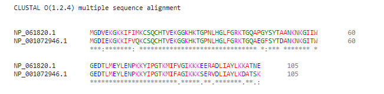
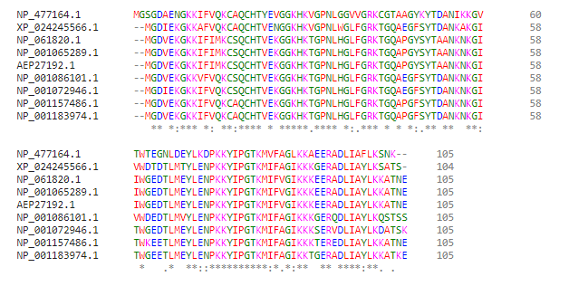
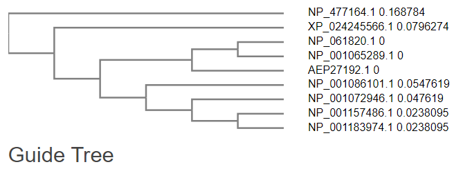

## ¿En qué se parecen una gallina y una mosca?

**PARA PENSAR: ¿Cuán sencillo será alinear dos o más secuencias a mano?** 
**¿Cuánto influirán el número de secuencias a alinear, su longitud, y la similitud entre ellas?**

A mano, sera mas sencillo a linear pocas secuencias, preferiblemente un par, que sean muy similares y que su longitud no sea muy larga.
Esto es debido aque alinear consiste en poner una secuencia debajo de la otra y comparar caracter con caracter e ir agregando gaps en caso de queun aminoacido este
ausente en una de las cadenas.

**PARA PENSAR: ¿Son parecidos los citocromos c de humano y gallo?**

Usando Clustal podemos ver que los citocromos del humano y el gallo tienen varias similitudes.
Pero usando mas secuencias de otras especies, podemos ver que el humano es mas similar a otros.

**PARA PENSAR: ¿Qué teorías subyacen a este análisis?**

Que mientras mas secuencias se agreguen en una alineacion, mas averiguas si las secuencias que queres comparar son realmene similares o si hay otras 
aun mas parecidas.

**PARA PENSAR: ¿Cómo nos ayuda la evolución a explicar sus similitudes y diferencias?**

Por parte de las similitudes, nos hace pensar en que hay un antepasado que comparten esas 2 secuencias, y las diferencias son causa de la misma 
evolucion, que hacen que sean algo diferentes por mutaciones sufridas.

**PARA PENSAR: ¿Qué indican los colores?**

Los colores indican los aminoacidos del mismo grupo.

**PARA PENSAR: ¿Qué indican el guión (-), los dos puntos (:) y el asterisco (*)?**

Los - son los gaps, que significa que no habia una secuancia para matchear.
Los * significa match perfecto, que la columna esta compuesta del mismo tipo de aminoacido.
Los : significa que no todas las secuencias de la columna son similares pero hay mas cantidad iguales.

**PARA PENSAR: A simple vista, ¿se conserva la secuencia del citocromo c en los organismos?**

Si, a simple vista la secuencia del citocromo en varios organismos no tiene mucha variacion.

**PARA PENSAR: ¿Creeríamos que todos los organismos se asemejan por igual al resto, o se pueden identificar grupos de mayor similitud?** 
**Si es así, ¿tienen sentido?**

Con la alineacion de secuencias, se puede separar en grupos de organismos mas parecidos a otros.
Como por ejemplo, el humano esta con el chimpance y el gorila. El resto de los animales no se parecen tanto y estan agrupados pero de poner mas
secuencias se agruparian en animales del mismo reino.

**PARA PENSAR: ¿Qué evidencias nos aportaría este análisis, a la luz de la evolución?**

A la luz de la evolucion, nos hace pensar que ciertos grupos vienen de un mismo antepsado, o varios antepasados.