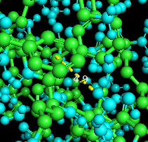
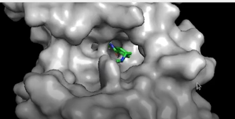

# Estructura de las proteinas

https://docs.google.com/presentation/d/1CGyCq7M64u9vmh6rwMRO4bEXdThvSmk_vyEk-7npzz0/edit?usp=sharing

## 1. ¿Cómo describirías la estructura de esta proteína?
**Las estructuras de las proteínas pueden ser muy diversas. Se las puede clasificar por su contenido en estructuras secundarias y según su cantidad**
**de dominios. ¿Cómo podrías describir la estructura de esta proteína? Realizá la misma descripción pero para la proteína 1THJ, 3OGB.**

- **1LXA**

Esta proteina presenta en su estructura secundaria secciones con loops, alfa helices y beta plegadas.
Posee una cadena y 2 dominios, uno gobernado por las alfa helices y otro por las beta plegadas.

- **1THJ**

Esta proteina presenta en su estructura secundaria secciones con loops, alfa helices y beta plegadas.
Posee solo una cadena y 3 dominios, los 3 gobernados por alfa helices y beta plegadas.

- **3OGB**

Esta proteina presenta en su estructura secundaria secciones con loops y alfa helices.
Posee solo una cadena y 1 dominio, gobernado por las alfa helices.

## 2. Proteínas con estructura cuaternaria
**Utilizando la estructura 1THJ vamos a usar un comando para ver las distintas cadenas que la componen. En la línea de comandos, escribí “split_chains”.** 
**Inmediatamente verás en el panel que la estructura 1THJ se ha subdividido en sus cadenas que la componen (A, B y C usualmente). Este comando también es** 
**útil para separar las cadenas cuando la estructura derive de un estudio NMR.**

Como se dijo antes, la proteina tiene 3 dominios y este comando lo demostro.
1THJ_A
1THJ_B
1THJ_C

## 3. Hetero átomos en las estructuras
**Utilizando la proteína 3OGB activá el panel “Sequence” y seleccione el grupo “HEM”**
**Una vez seleccionado el grupo Hemo, visualizá el mismo en formato “lines” o “stick”. Esta forma nos permite visualizar grupos que no están formados** 
**por aminoácidos.**

Los grupos que no están formados por aminoácidos son el agua al rededor de la proteina y el atomo, imagino sera un metal, para poder atraer oxigeno
y transportarlo, tal como dice la descripcion de la proteina.

## 4. Un mar de conformaciones...
**Estudiá la proteína 2CPE. ¿Qué tipo de proteína es? ¿Cómo la describirías?** 

Proteina de una cadena y unico dominio, formada por estructuras helice alfa, beta plegadas y loops.
Los loops son la estructura dominante y tiene un core formado con las helices alfa y beta plegadas.

**Utilizá el comando “set all_states, on” para ver todos los estados conformacionales estimados para esa estructura.** 
**Compará el espacio conformacional de la 2CPE con la de la estructura de la mioglobina (1MYF).** 

El espacio conformacional de la estructura 1MYF es escaso, la proteina no tiene mucho movimiento, en cambio la de la proteina 2CPE es muchisimo mas
variado, tiene muchas mas posiciones.

**Utilizando el modo secuencia, seleccioná la HIS 64. Mostrala en formato stick o lines. ¿Qué función podría llegar a tener? ¿Y la HIS 93?**

 Podria llegar a tener la funcion de atraer algunos atomos con cargas opuestas.
 
 **RETO I: Estas estructuras difieren de las estructuras sobre las que venimos trabajando en su determinación. Como habrás notado estas fueron obtenidas** 
 **mediante la técnica de MNR, ¿Pero en qué consiste esta técnica?**
 
 MNR es la tecnica con la cual podemos observar los detalles mas pequeños de las moleculas y observar como se comportan e interactuan.
Se usa mucho en investigaciones contra el cancer, donde ayuda a encontrar formas de administrar medicamentos.

Esta tecnica consiste en poner las molecuclas en un campo magnetico para que algunos nucleos de los atomos que la conforman empiecen a comportarse
como un pequeño magneto. Despues se aplican radiofrecuencias y los nucleos comienzan a rezonar en su propia frecuencia. 
Las frecuencias de los nucleos suelen hacer que otros nucleos de otros atomos cercanos tambien comiencen a rezonar, dando informacion sobre su
ubicacion.
Esas frecuencias son medidas en picos y gracias a esto se puede determinar la estructura tridimensional de las moleculas y como estas se mueven.

## 5. Cálculo de la distancia promedio de un puente de hidrógeno.

**RETO II: Investigá en qué consisten las interacciones puentes de hidrógeno,  π-π y π-catión y qué aminoácidos podrían intervenir en dichas interacciones.**

Una interaccion π-π es cuando 2 anillos aromaticos de carbono se suelen juntar, por mas que sean de la misma carga negativa.
Luego estan las interacciones π-catión que es cuando un anillo aromatico de carbono atrae a un cation, que es un ion de carga positiva.

La medicion 4.4 de un π-π formados por aminoacidos ILE y ASP

La medicion 4.6 de un π-cation

## 6. Identificación de interacciones π-π y π-catión

Interacciones π-π

Interacciones π-cation

Se intorujo el codigo PDB en la pagina http://capture.caltech.edu/ y se encontro que en la proteina 1A7E existen 11 interacciones π-catión 
y abajo copio el resultado

´´´´

***********************  Cation-Pi Summary  ***********************

Number of ARG/PHE interacting pairs:	2

Number of energetically significant ARG/PHE cation-pi interactions:	1

The following are the energetically significant ARG/PHE cation-pi interactions:

Cation	AA #	Chain	Pi	AA #	Chain	E(es)		E(vdw)
						(kcal/mol)	(kcal/mol)

ARG	15	A	PHE	17	A	-1.97		-1.16

Number of ARG/TYR interacting pairs:	0

Number of energetically significant ARG/TYR cation-pi interactions:	0

Number of ARG/TRP interacting pairs:	1

Number of energetically significant ARG/TRP cation-pi interactions:	0

Number of LYS/PHE interacting pairs:	6

Number of energetically significant LYS/PHE cation-pi interactions:	2

The following are the energetically significant LYS/PHE cation-pi interactions:

Cation	AA #	Chain	Pi	AA #	Chain	E(es)		E(vdw)
						(kcal/mol)	(kcal/mol)

LYS	108	A	PHE	14	A	-6.09		-0.90
LYS	115	A	PHE	112	A	-5.33		-1.46

Number of LYS/TYR interacting pairs:	4

Number of energetically significant LYS/TYR cation-pi interactions:	1

The following are the energetically significant LYS/TYR cation-pi interactions:

Cation	AA #	Chain	Pi	AA #	Chain	E(es)		E(vdw)
						(kcal/mol)	(kcal/mol)

LYS	83	A	TYR	98	A	-5.21		-1.22

Number of LYS/TRP interacting pairs:	2

Number of energetically significant LYS/TRP cation-pi interactions:	1

The following are the energetically significant LYS/TRP cation-pi interactions:

Cation	AA #	Chain	Pi	AA #	Chain	E(es)		E(vdw)
						(kcal/mol)	(kcal/mol)

LYS	26	A	TRP	10	A	-6.49		-1.32

* There is a total of 5 energetically significant cation-pi interactions.

* There are 4 cation-pi interactions with E(es) <= -2.0 kcal/mol

* There are 1 cation-pi interactions with E(es) between -2.0 and -1.0
  kcal/mol and with E(vdw) <= -1.0 kcal/mol

* There is an average of 1 cation-pi interaction for every 23.6 residues.

´´´´

## 7. Sitio activo de la anhidrasa carbónica

**¿Cuántas subunidades (cadenas) tiene la estructura nativa?**

Usando el comando split chains vemos que tiene 3 subunidades

**¿Tiene heteroátomos esta molécula? ¿Cuáles?**

Tiene 3 atomos de ZN, Zinc y cada uno tiene un atomo de Oxigeno

**Identificá los residuos que unen el Zinc. Para ello utilizá los siguientes comandos:**

- select zincs, metals
- select nearzincs, zincs around 6

Luego de tirar el comando sale lo siguiente:
Selector: selection "nearzincs" defined with 248 atoms.

**También se puede usar el comando:** 

- select all within 6 of metals.

**Cambiá la visualización de la selección a bolas y palillos.**
**¿Los residuos que unen el Zinc pertenecen a la misma subunidad?**

No me parece que sean de la misma subunidad debido a que estan flotando y no salen de una de las cadenas.

**Determiná los contactos proteína-proteína en la estructura cuaternaria de la anhidrasa carbónica. En este punto usaremos distintos programas para** 
**establecer qué aminoácidos participan en contactos proteína-proteína. Para ello accedé al servidor Protein-Protein interaction server** 
**InterProSurf (http://curie.utmb.edu/pdbcomplex.html) y cargá el código pdb 1THJ. Registrá el número de los residuos que mantienen contactos entre** 
**subunidades. Visualizá los mismos en Pymol. Utilizá la barra de secuencia o los siguientes comandos:**
 
- select interactingA, chain A & resi x+x+x+x… 

**donde x es el número de los residuos que se desea seleccionar (Obtenidos de InterProSurf). Realizá la misma operación para las cadenas B y C.**

- PyMOL>select interactingC, chain C & resi 212+212+209
 Selector: selection "interactingC" defined with 38 atoms.
- PyMOL>select interactingB, chain B & resi 212+212+209
 Selector: selection "interactingB" defined with 38 atoms.
- PyMOL>select interactingA, chain A & resi 212+212+209
 Selector: selection "interactingA" defined with 38 atoms.

 
## 8. Uso de superficies y slab mode en Pymol

## 9. Estudio de la porina de N. gonorrhoeae

**Utilizando el programa Pymol estudiá la estructura terciaria y cuaternaria de la proteína 4AUI.** 
**Determiná la superficie, localizá ligandos e identifícalos.**

Es una proteina de 3 cadenas conformadas por estructuras beta plegadas y loops.

Con la pagina de PDB vemos estos ligandos:

ATP
ADENOSINE-5'-TRIPHOSPHATE

MG
MAGNESIUM ION

PO4
PHOSPHATE ION

## 10. Estudio de túneles

Se adjuntan las imagenes de los tuneles de las secuencias de 1THJ y 1F90 vistos con el programa Mole.

## 11. Estudio de pockets en EGFR

Primero se observa en pymol la proteina del 3W32, el conformero inactivo, despues de descargar el zip de la pagina https://mobyle.rpbs.

Por lo que se ve, sus tuneles son mas superficiales, no tan profundos ni tan amplios. Salvo por el tunel central, que llega a hacer un hoyo.
Se destaca tambien que tiene muchisimos mas tuneles que la proteina activa.

Luego comparamos con la proteina 1M14, el conformero activo.

Se le detectaron solo 3 tuneles, pero los cuales atraviesan la proteina.

## 12. Túneles y diseño de fármacos

**Tomando como base la estructura PDB 3GPC, estudiá sus túneles utilizando el Fpocket** 
**¿Encontrás algún/os túnel/es en la proteína donde pueda unirse algún fármaco?** 
**¿Qué residuos se encuentran en dicha cavidad?**

La proteina posee un tunel muy profundo, es su sitio activo, y se le envio un farmaco para obstruir ese tunel e imedir que la proteina funcione.
Dice que es el residuo 578 COA

**RETO III: Investigá en qué consiste el docking, en qué ideas basa su funcionamiento.**

Docking es una técnica de mecánica molecular usada para predecir modos de enlace entre ligandos y proteínas, para el estudio de nuevos compuestos
con efectos terapéuticos, donde los resultados obtenidos van a tender a la subjetividad, debido a que los programas utilizados para llevarla a cabo 
proporcionan más de un criterio de selección de la mejor pose.

**Descargá la estructura de la proteína y la del inhibidor y visualizalas en Pymol**

**¿Dónde se une el inhibidor? ¿Coincide con el túnel que propusiste anteriormente? ¿Dada esta inspección ocular cómo creés que actúa el inhibidor?** 

El inhibidor se une en el tunel de la proteina. Si, coincide con los los tuneles vistos en la observacion anterior.
Como se explico anteriormente, el inhibidor se posiciona en el mejor lugar del tunel de la proteina para impedir que esta actue.

## 13. Asignación de estructura secundaria basado DSSP

- **Primero determiná la estructura secundaria de ambas conformaciones por separado usando el sevidor https://2struccompare.cryst.bbk.ac.uk/index.php**
	**1. Corré el análisis por separado de cada estructura (recuadro derecho), cargando su código PDB y haciendo click en submit**
	**2. Observá las distintas regiones de estructura secundaria, ¿todas son de igual cantidad de residuos?** 
	**¿Se requieren más o menos residuos para formar una alfa hélice que un loop? ¿Por qué?**

Por lo que veo, en la 3F8V tiene bucles hechos de 5 a 21 residuos y como minimo tiene una beta plegada hecha de 2 residuos. Esta proteina tiene mas
residuos en las partes alfa helices que en el resto.
La 4LMZ distribuye mejor los residuos entre helices alfa y plegadas, ya que puden llegar a tener un numero parecido, aunque aun asi se nota que tiene 
mas beta plegadas.

Un alfa helice necesita mas residuos que un loop debido a que para poder girar sobre si mismo, debe formar puentes de hidrogeno.
Un residuo no va a formar un puente de hidrogeno con el aminoacido que le digue, sino que lo va ahcer recien con el tercero de la secuencia.

4LMZ

3F8V

- **Luego podemos comparar ambas conformaciones utilizando el mismo servidor https://2struccompare.cryst.bbk.ac.uk/index.php.** 
**Esta vez cargaremos las estructuras a la par (recuadro izquierdo) y el servidor nos mostrará las diferencias**
	**1.Utilizando el botón Colour Scheme específicá las zonas de mayor movimiento de la proteína**

La 3F8V predominan los bucles, mientras que en la 4LMZ predominan las plegadas.
En la 4LMZ se notan bien diferenciadas las 2 cadenas unidas por un bucle, mientras que en la 3F8V da impresion de ser una unica cadena.
La 3F8V tiene heteroatomos y aguas mientras que la otra no se le ve ninguna.

Segun el dibujo superpuesto, la 4LMZ es mas grande que la 3F8V, es mas estirada.
Se puso Colour Scheme diferenciando las cadenas.

La 4LMZ da impresion de tener mas movimiento que la 3F8V

