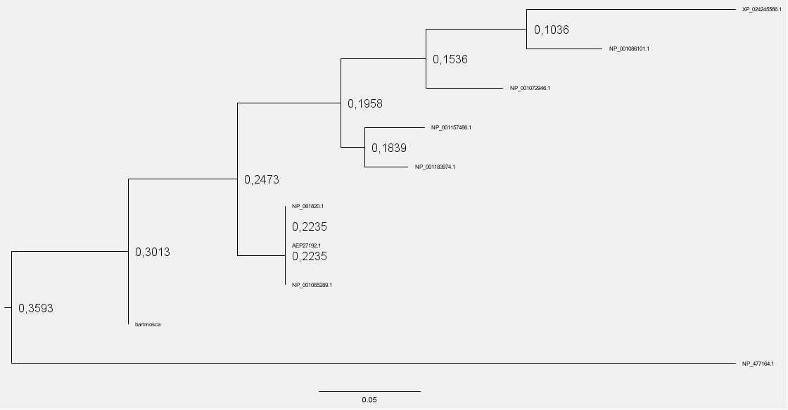

## Inferencias Evolutivas

- bartmosca MGSGDAENGKKIFVQKCAQCHTYEVGGKHKTGPNLHGLFGRKTGQAPGYSYTAANKNKGIIWGEDTLMEYLENPKKYIPGTKMIFVGIKKKEERADLIAYLKKATNE

**DESAFÍO I: Detalla las tácticas y/o metodologías que deberían utilizarse para darles una respuesta a los padres del niño.** 
**Dadas las secuencias de Mosca, humano y Moscahumano ¿Qué criterios se les ocurren para comparar las secuencias?** 
**¿Qué resultados obtienen del análisis anterior? ¿Qué resultado esperaría obtener si utilizara el resto de las secuencias en el análisis? ¿Por qué?**

Como metodologia utilizaria la alineacion de secuencias para ver que tan parecidas son.
Debido a que las secuencias son casi similares en tamaño y en composicion, utilizaria alineacion global, para comparar toda la secuencia y no 
solo una parte, y utilizaria alineacion multiple debido a que son mas de 2 secuencias.

Si utilizaramos el resto de las secuencias, seguramente nos muestre que el bartmosca se parezca a algo mas, o no y los hagan salir del mismo arbol
que el del hombre y la mosca.


**DESAFÍO II: Como vimos anteriormente existen algunos softwares optimizados para confeccionar alineamientos de secuencias.** 
**En particular hemos trabajado con Clustal (Larkin et al. 2007). Confecciona el alineamiento para el punto I.**

Alineando solo el hombre, la mosca y el bartmosca


Alineando todas las scuencias, vemos que el bartmosca es mas humano que mosca


**DESAFÍO III: Mediante el uso del servidor de IQtree (Trifinopoulos et al. 2016), confecciona los árboles filogenéticos para los alineamientos** 
**obtenidos en el punto II. Como vemos, el servidor nos permite elegir el modelo de sustitución ¿A qué se refiere?** 

El modelo de sustitucion sirve para establecer puntajes de match/mismatch o gap en el momento de realizar la alineacion y se debe elegir la mejor
opcion para nuestro modelo de datos o dejar el valor AUTO que encuentra cual es la mejor opcion para el alineamiento.

Ambos arboles parecen poner al bartmosca a la misma altura de la mosca.
Pareciera que no lo ubico tan parecido al hombre.

````

+-----------------------------------------------------------NP_477164.1
|
+-------------NP_061820.1
|
+**bartmosca

````

````

+----------------------------------------------------------NP_477164.1
|
|                          +-------------XP_024245566.1
|                   +------| (88.7)
|                   |      +----NP_001086101.1
|             +-----| (86.9)
|             |     +----NP_001072946.1
|      +------| (94.7)
|      |      |  +---NP_001157486.1
|      |      +--| (74.1)
|      |         +--NP_001183974.1
+------| (90.9)
|      |  +**NP_061820.1
|      +--| (85.3)
|         +**NP_001065289.1
|
+**bartmosca

````

Esto es lo que nos brindo IQTree

(NP_477164.1:0.4173175503,((((XP_024245566.1:0.1035647953,NP_001086101.1:0.0375209962)85:0.0499956857,NP_001072946.1:0.0381651107)83:0.0422277496,(NP_001157486.1:0.0296355027,NP_001183974.1:0.0213616926)60:0.0118771234)86:0.0514783747,((NP_061820.1:0.0000000000,AEP27192.1:0.0000000000):0.0000021464,NP_001065289.1:0.0000021464)86:0.0237175833)88:0.0540375791,bartmosca:0.0000027370);

**¿Qué es el Bootstrap?** 

Es una tecnica que se usa para dar soporte a la generacion de arboles filogeneticos.
Toma secuencias al azar y ve cuanta probabilidad hay de generar el arbol que obtuviste.

**¿De qué manera nos habla de la calidad de nuestro árbol? ¿Cómo influye el número de Bootstraps en el resultado?** 

De la tecnica de boostraping, a partir de las secuencias brindadas, se generaran varios alineamientos, lo que nos permite 
realizar una estima de la robustez de nuestro arbol.

Mientras mas boostrap, mejor el resultado es porque habra mas alineaciones con la cual comparar.

**Interpreten los resultados obtenidos, mediante la visualización de los árboles con la herramienta FigTree.** 
**¿Es necesario realizar algún paso extra, previo a la interpretación del árbol? ¿Por qué?**

Agregando lo obtenido en IQTree al Figtree obtenemos lago de este estilo


Antes de interpretar los resultados, se deben routear algunas ramas del arbol, y le damos una direccion al tiempo evolutivo de esa secuencia.



De este analisis se puede saber que especies surgieron antes y despues y cuales estaban mas relacionadas entre si.
En cuanto al hombre mosca, se puede apreciar que esta entre la mosca y el hombre pero no tan relacionado a alguno de ellos.
Es más, el hombre esta mas relacionado al gorila y al chimpance.


